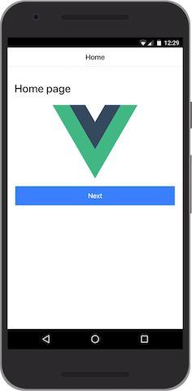
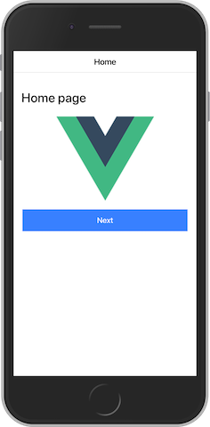

# ionic-vue-sample

| Android                            | iOS                        |
| ---------------------------------- | -------------------------- |
|  |  |

## Project setup

```
npm install -g @vue/cli
npm install -g ionic
```

```
npm ci
```

### Compiles and hot-reloads for development

```
npm run serve -- --open
```

### Compiles and minifies for production

```
npm run build
```

### Android build

```
npm run build
ionic capacitor add android
ionic capacitor open android
```

### iOS build

```
npm run build
ionic capacitor add ios
ionic capacitor open ios
```

### Run your tests

```
npm run test
```

### Lints and fixes files

```
npm run lint
```

### Customize configuration

See [Configuration Reference](https://cli.vuejs.org/config/).
